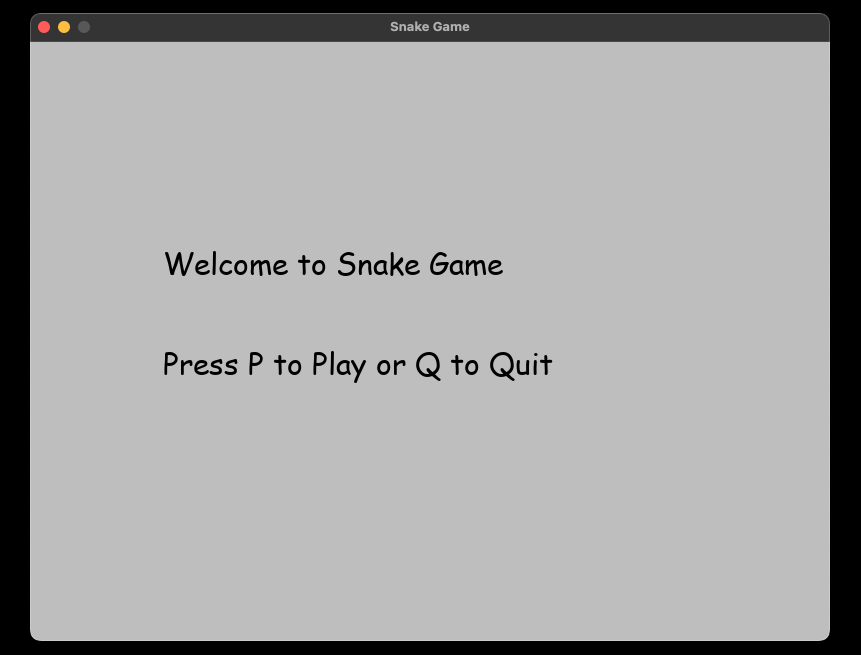

## A classic Snake Game implemented in Python using the Pygame library. This game includes features like scoring, a main menu, and game over states.

## The code will work if you have Python 3 or higher installed

## Installation

1. Ensure you have Python installed on your machine.
2. Install Pygame using pip:

   ```bash
   pip install pygame 
   ```

3. Clone this repository:

- Go to the `< > Code` and copy the clone that you need.

4. Navigate to the project directory:
   ```bash
   cd snake_game
   ```

5. Run the game:
   ```bash
   python snake_game.py
   ```
   
- If you have done everything correctly you will see a window with the game.





## How to Play
Use the arrow keys to move the snake.
Eat the green food blocks to grow the snake and increase your score.
Avoid colliding with the walls or the snake's own body.

Code Overview

snake_game.py: The main game file containing all the logic for the Snake Game.
 